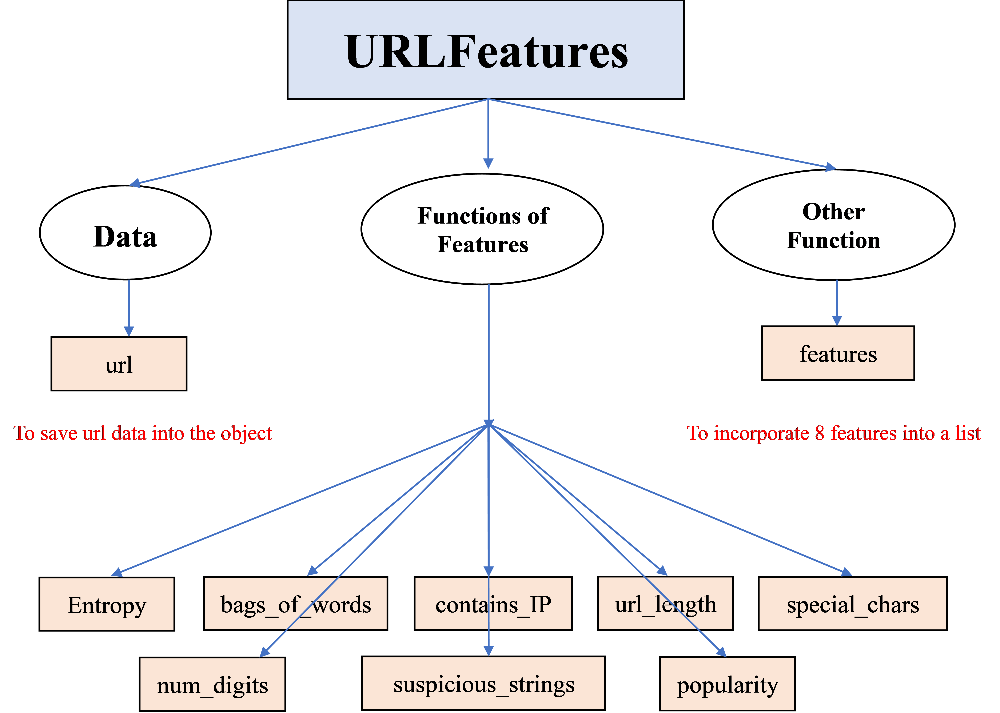

# Detection of Malicious Website's URL
## 0. Group-#11 Members

Name | Github ID | Student ID 
:-: | :-------------------------------: | :-:
[Lei HU](https://github.com/huleipku)     |     huleipku     |     1901212585    
[Jinze HE](https://github.com/Hejinzefinance)     |     Hejinzefinance     |     1901212582    
[Yixin ZHAO](https://github.com/Zhaoyixin9705)     |     Zhaoyixin9705     |     1901212681    
[Aiyu CAO](https://github.com/caoxiaolong0521)     |     caoxiaolong0521     |     1801212821    

##  1. The Goal of our Project
In order to **detect the security of a URL** (i.e. whether the website is malicious), we try to construct some reasonable features from the urls in`malicious_urls.csv` and `benign_urls.csv` . Then we use them to train our machine learning detection model.

## 2. Framework of our Project

1. Preprocess data & extract features

2. Train model via Random Forest & Model Evaluation 

3. Model Application

## 3. Data Preprocessing & Feature Extraction

###  3.1 [Description of Dataset](data)

### 3.2 Preprocessing
* In this part, the preprocessing means that we want to **remove the prefix** like `http://` or `https://` from the URLs. The reason is that the prefix is not helpful to judge the website, or even affect the calculation of the features.
* In the code, we define a function `parse_url` to remove the prefix. If you want to see the source code, please turn to [Part-1 Create_dataset_for_training_model.ipynb](Part-1/Part-1%20Create_dataset_for_training_model.ipynb).

### 3.3 Feature Selection
Feature name | Explanations about the feature 
:-: | -
`Entropy` | Entropy was originally a concept proposed in the field of physics, which is used to *measure the degree of chaos in a system*. Then, Shannon borrowed this concept and proposed the information entropy. And many researches have shown that **malicious URLs often have a higher information entropy**. And the class `Entropy` is to calculate the information entropy.
`bag_of_words` | Research also shows that **malicious URLs usually contains more words of different categories**, so *how many different kinds of words* that have appeared in the URL can also be an effective feature. And `bag_of_words` is to calculate this feature. 
`contains_IP` | *Whether a URL contains an IP address* is also a powerful indicator. So we need to check the occurence of an IP address within a URL since the **benign URL will not contain IP** in most cases.
`url_length` | It is intuitive that **malicious URLs can often be very long** in comparison to benign URLs. For example, the official website of [Baidu](https://www.baidu.com/), [GitHub](https://github.com/), [Google](www.google.com) are all relatively short.
`special_chars` | Sometimes **malicious URLs contain a larger number of special characters**, like ';','%','!','&',':', etc. So we introduce the feature `special_chars` to reflect. 
`num_digits` | Researches also show that **malicious URLs usually contain more numbers**. So the number of digits is also a good feature.
`suspicious_strings` |  A higher number of suspicious strings would more possibly indicate a malicious URL. So we introduce `suspicious_strings` to describe the feature.
`popularity` | If a website is more popular, it means more people are willing to visit, which reflects the low chance or possibility to be malicious. So the websites contained within the top 1 million URLs dataset are not likely to be malicious.

### 3.4 Feature Calculation
* After selecting the features to use, we established a class called `URLFeatures` to calculate the value of the features. 
* The picture below shows the structure of the class. The class `URLFeatures` contains 9 function members (8 functions for calculating, 1 final function for incorporating the URL and its corresponding features into a list). 

* Based on `parse_url` and `URLFeatures`, we defined the function `extract_features` to combine the preprocessing part and the calculation of features into one step.
* At last, we define the function `create_dataset` to calculate the 8 features of our selected data and save them into `data_urls.csv` (*it will take approximately 2-3 hours*).
* The source code is in [Part-1 Create_dataset_for_training_model.ipynb](Part-1/Part-1%20Create_dataset_for_training_model.ipynb).

### 3.5 Create Dataset ([data_urls.csv](data/data_urls.csv))

+ After loading 10000 urls and extracting their 8 features, we store the data in csv format to prepare for training model below

## 4. Train Model via Random Forest & Model Evaluation
### 4.1 Train Model

* After we obtain the training data (`data_urls.csv`), we need to train the model next.
* The model we chose is the **Random Forest** (we also tried other models like SVM and logistic regression, but the result is not so good. *The comparison among different models is shown in the appendix in the end*). 
* The source code of training the model is in [Part-2 Train_model.ipynb](Part-2/Part-2%20Train_model.ipynb).

### 4.2 Model Evaluation

* In order to evaluate the performance of the model, we mainly used ROC curve, Confusion Matrix, explained variance components and learning curve. The figures and corresponding results are shown below.

1. **ROC curve**:  **ROC** curve is far from diagonal line and **AUC** is near from 1. Thus, our model's prediction ability is well.

2. **Confusion Matrix**:  **PRE** & **REC** are really high, indicating our model is doing well.

3. **Feature Importance**:  From the picture below, we can see the importance of each features and the **first 6 features** are significantly useful.

* In addition, based on the features' importance above, *we test model's accuracy* **with different numbers of most useful features** (i.e. *use the most important k features instead of all* to see whether there is the chance to reduce dimensionality). 
* As we can see in the figure below, the accuracy score is the highest when we use the first 6 features. However, we still use all of the 8 features in the final part, because the models with 6 and 8 features have similar accuracies.

4. **Learning Curve**:  From the **learning curve**, we can see that our model is **not biased** and **variation** is **not** very **high**.

 

* As for other indicators, the **cross-validation score** is *87.75%* and **F1-score** is *89.38%*, the results are shown in [Part-2 Train_model.ipynb](Part-2/Part-2%20Train_model.ipynb).

## 5. Model Application
* In this *extension part*, the main purpose of our group is to **encapsulate the trained model into some functions** for the users to call when they want to detect whether a new website's URL is malicious.
* We defined the function `classify_url` based on the trained model to classify a new website's URL. But before the prediction, we need to check whether the input URL is in a valid format using the function `check_valid_url`, and we need to extract the URL's features using the function `get_url_info`.
* **Combining the above 3 functions**, we define the function `apply_classify_url` which is designed for users to call when detecting malicious websites (*we show some samples of calling this function in the last part of the code*).
* The source code is in the last part of [Part-2 Train_model.ipynb](Part-2/Part-2%20Train_model.ipynb).

## Appendix
### A.1 Comparison Among Models
&nbsp;   |  Logistic Regression |  Support Vector Machine | Random Forest
:-: | :------: | :------: | :------: 
*Accuracy(Train)*     |     80.96%    |     85.68%   |  **89.12%**
*Accuracy(Test)*     |    82.05%   |     83.85%  |  **87.75%** 
*Precision*     |     75.64%   |     78.53%   |   **88.19%**
*Recall*    |    90.50%     |     **96.74%**  |   90.60%
*F1-score*    |    82.41%     |   86.69%  |   **89.38%**
*Parameters* | `{kernel='rbf',gamma='auto', random_state=0}` | `{solver='liblinear',random_state=0}` | `{'max_features': 'sqrt', 'n_estimators': 200}`

* Except for the value of **recall**, all the other indices of the random forest are the largest. And the random forest model's recall value is greater than 90%, which we think is also relatively high, so we chose random forest model finally.

  

### A.2 Explanations about Professor's Comments/Questions

**Q1**: Based on your Learning curve, the test accuracy is always 100%, I am wondering if you are making any mistakes. 

**A1**: For our learning curve, the **train accuracy**(black line) is indeed always 100% (*the test accuracy converges to approximately 80%*). Maybe there is some over-fitting in our model, but as the test accuracy(red line) is higher that 80%, we think the degree of over-fitting is acceptable.

**Q2**: Why did you pick Random Forest? Did you compare with other methods?

**A2**: We used Logistic Regression, SVM and Random Forest respectively for our sample data. After comparing all the model evaluation measures, which have been listed in Appendix A.1, we chose Random Forest in the end.

**Q3**. The PCA part is not relevant. After doing PCA, you're not using those 6 factors. Instead, you can show the feature important using RF to see which factors are important.

**A3**. Based on professor's suggestions, we use the predefined attribute of the Random Forest model (`.feature_importances_`) to show the features important instead of the irrelevant PCA method. And the result is added **in Part 4.2**, which shows the importance of different features. Although using the first 6 features will predict slightly more accurate, we still use all of the 8 features in the final part, because the models have similar accuracies when using more than 5 features (the result is shown in the **part of 3 in Part 4.2**). Hence, we did not eliminate the rest 2 features, `special_chars` and `contain_IP`.